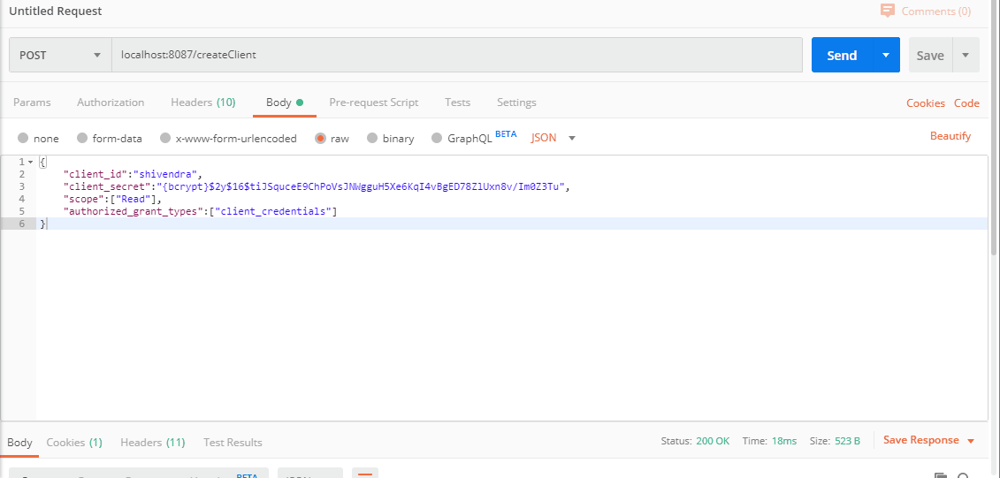
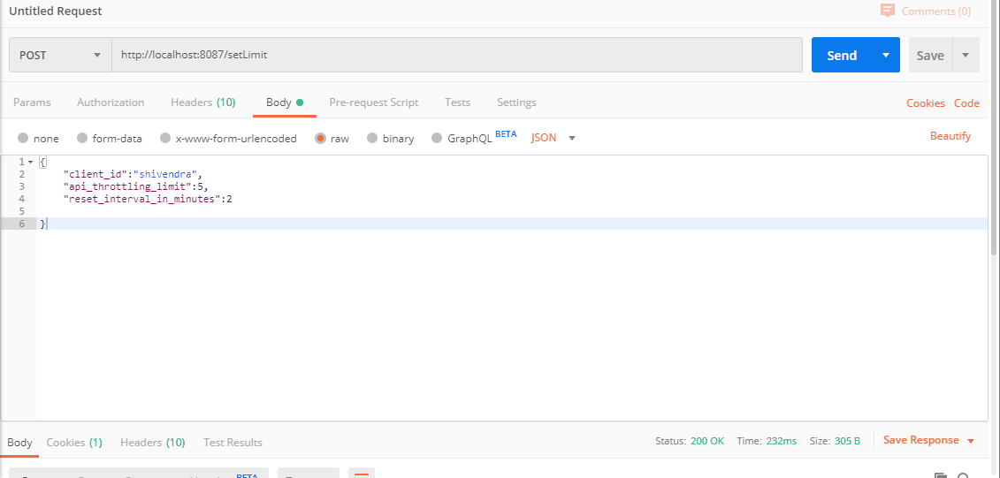
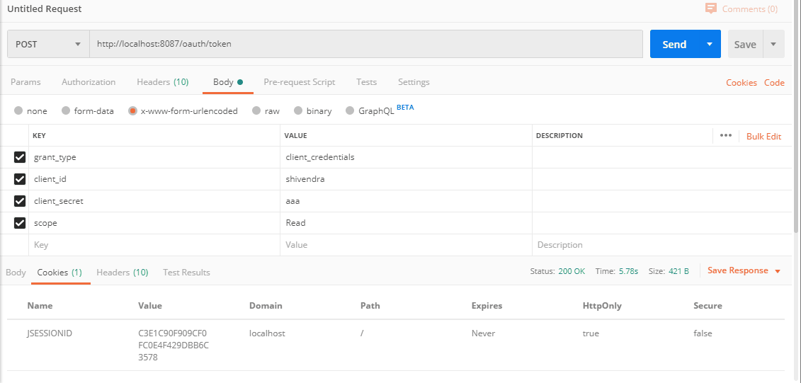
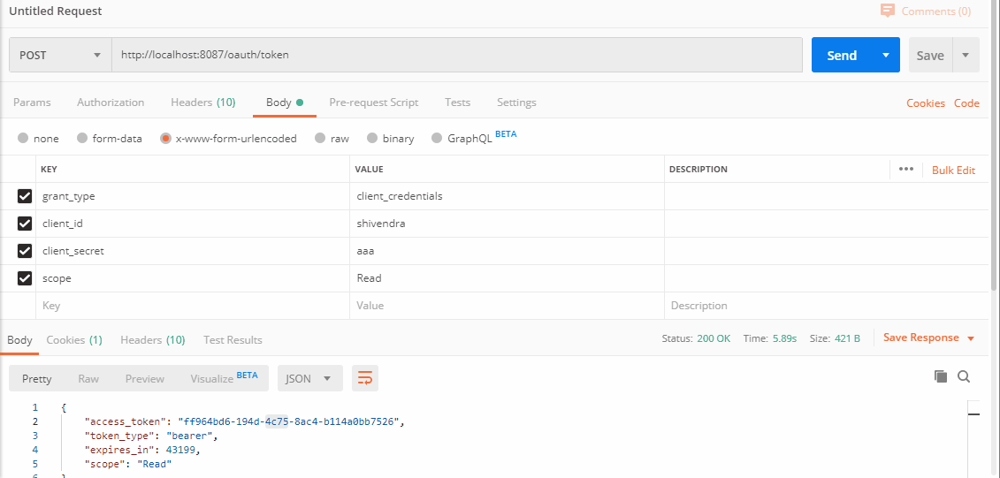

# Oauth2AuthorizationServer
## Description:
 Simple Oauth2 based Authorization server for creation of access tokens and their validation. Inbuilt RateLimiter for granular control of number of API calls per client.
 
## Technology Stack:
* *Spring Boot* as framework
* *Spring Security Oauth2* for client registration,generation and validation of access tokens
* *Spring Data Redis* for persistence of client details and access tokens.
* *Redisson* for implementation of API RateLimiter.

## Demo:
* Registration of new Client.
* **Note:** client secret must be encrypted (i.e. with Bcrypt)

* Setting API throttling limit

* Generating access token
* **Note:** client secret passed in request must be decrypted one

* Resource Access with throttling limit of 5 requests per 2 minutes

## Usage:
* Download the source and build it using ``mvn clean package``
* Run the application using ``java -jar Oauth2AuthorizationServer-1.0.jar``
* Rest calls can be made as shown in demo above by sending appropriate reqeusts to http://localhost:8087
* **Note:** Redis server must be configured in application.properties for this app to work.

## License:

